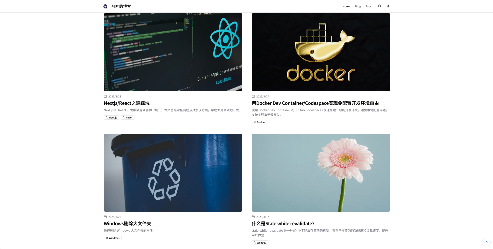
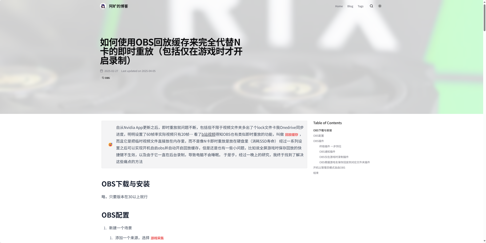
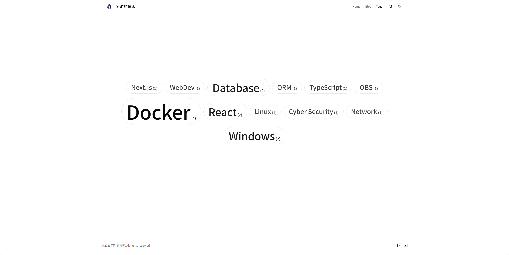

# Notion-Powered Static Blog

[](https://nextjs.org/)
[](https://www.typescriptlang.org/)

基于 Next.js App Router 和 Notion API 构建的高性能静态博客，Notion 作为内容管理系统，支持增量静态再生（ISR）和丰富的交互体验。

简体中文 | [English](./README_EN.md)

示例图片





## 特性亮点

- 基于 Notion 的零成本内容管理
- 自动增量静态生成（ISR）
- 暗黑模式支持
- 响应式设计
- 简约风格
- 内置 SEO 优化

## 技术栈

- ​**​ 框架 ​**​: Next.js 15 (App Router)
- ​**​ 数据层 ​**​: Notion API
- ​**​ 样式 ​**​: Tailwind CSS
- ​**​ 图标 ​**​: Lucide
- ​**​ 组件库 ​**​: Shadcn UI
- ​**​ 动画 ​**​: Tailwindcss-Animate

## 部署

1. 复制[模板数据库](https://zephyrrr.notion.site/1be1f833110780d98383fc637676cee8?v=1be1f833110780839e62000c8c92f8e3&pvs=4)
2. 修改数据库权限为公开

3. 获取 Notion 数据库 ID：

   - 复制 URL 中 `?v=` 之前的部分（如：`1be1f833110780d98383fc637676cee8`）

4. 配置环境变量或者直接修改 `blog.config.ts`

   ```typescript
   NOTION_PAGE_ID=你的数据库ID

   // blog.config.ts
   NOTION_PAGE_ID:
      process.env.NOTION_PAGE_ID || "修改成你的数据库ID",
   ```

5. 推荐使用 Vercel 部署，简单方便

   - Fork 本项目
   - 注册 Vercel 账号
   - 然后连接你的 GitHub 账号
   - 然后点击 `New` 按钮，选择 `Import Git Repository`
   - 配置环境变量 `NOTION_PAGE_ID`
   - 选择你的项目，然后点击 `Deploy` 按钮
   - 等待部署完成

6. 也可以使用 Docker 部署，已经提供了`Dockerfile`

   - 注意如果使用环境变量，建议创建一个`.env`文件后，再进行镜像 build, 不然无法在 build 时获取到环境变量
   - 示例 docker-compose.yml 文件如下：

     ```yaml
     version: "3"

     services:
     blog:
       build:
         context: .
       ports:
         - 3000:3000
     ```

## 配置项

可以直接在 Notion 里进行大部分配置，除了 `NOTION_PAGE_ID` 和 `NEXT_REVALIDATE_SECONDS` 需要手动配置

## 感谢

借鉴了以下的优秀项目：

- [Shiro](https://github.com/Innei/Shiro)
- [Notion Next](https://github.com/tangly1024/NotionNext)
